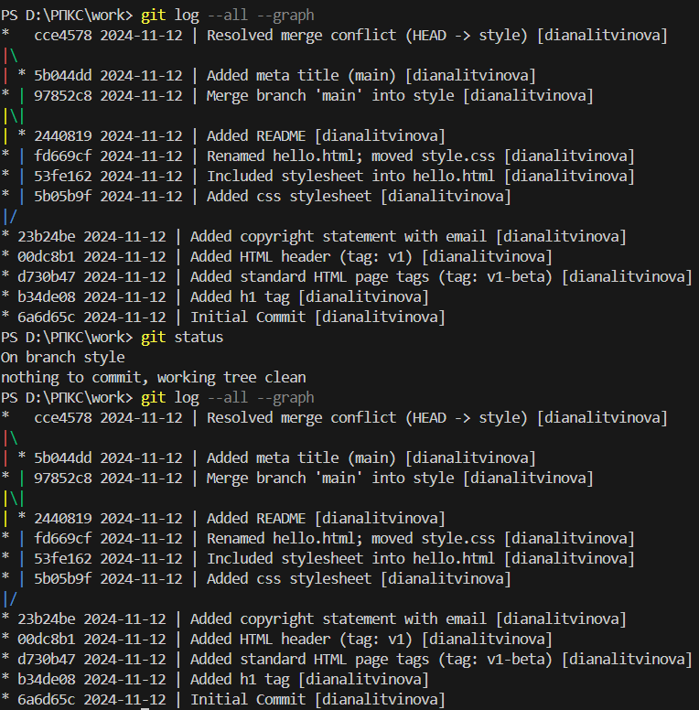

### Лабораторна робота 1: Знайомство з Git

  

На першому скріншоті показано налаштування глобальної конфігурації Git за допомогою команди git config --global. Було встановлено:

Ім'я користувача (user.name): dianalitvinyova
Електронну пошту (user.email): syrochkalitvinyova04@gmail.com
Основну гілку за замовчуванням (init.defaultBranch): main
Налаштування автоматичного переведення рядків (core.autocrlf): input
Включення автоматичного переведення рядків (core.autocrlf): true
Налаштування безпечного переведення рядків (core.safecrlf): warn

  

На другому скріншоті показано створення нової директорії "work" за допомогою команди mkdir work. Після створення можна побачити інформацію про новостворену директорію, включаючи дату та час створення (12.11.2024 16:55). Далі виконано перехід до цієї директорії за допомогою команди cd work.

  

На третьому скріншоті показано:

Створення файлу hello.html з текстом "Hello, World" за допомогою команди echo
Ініціалізацію нового Git репозиторію командою git init
Додавання файлу до індексу Git командою git add hello.html
Створення першого коміту з повідомленням "Initial Commit"

  

На четвертому скріншоті показано перевірку статусу Git репозиторію за допомогою команди git status. Результат показує, що ми знаходимось на гілці main, і робоче дерево є чистим (немає незакомічених змін).

  

На п'ятому скріншоті показано вміст створеного файлу hello.html, який містить простий HTML-код з заголовком першого рівня "Hello, World!".

  

На шостому скріншоті показано результат виконання команди `git status`, який відображає зміни у файлі hello.html, що ще не додані до індексу (not staged). Git пропонує використати команду `git add <file>` для додавання змін до індексу або `git restore <file>` для скасування змін у робочій директорії.

  

На сьомому скріншоті показано процес додавання змін файлу hello.html до індексу за допомогою команди `git add hello.html`. Після виконання команди `git status` бачимо, що файл тепер знаходиться у статусі "Changes to be committed" (зміни готові до коміту).

  

На восьмому скріншоті показано вікно редактора COMMIT_EDITMSG, де вводиться повідомлення для нового коміту. У першому рядку вказано опис змін "Added h1 tag", а також показані коментарі Git про те, які файли будуть включені до коміту.

  

На дев'ятому скріншоті показано успішне створення коміту з повідомленням "Added h1 tag" та його ідентифікатор [main b34de08]. Після цього виконано перевірку статусу репозиторію, яка показує, що робоче дерево чисте і немає незакомічених змін.

  

На десятому скріншоті показано оновлений вміст файлу hello.html, який тепер містить повну HTML-структуру з тегами html, body та h1, що відображає текст "Hello, World!".

  

На одинадцятому скріншоті показано додавання змін файлу hello.html до індексу за допомогою команди `git add hello.html`.

  

На дванадцятому скріншоті показано оновлений вміст файлу hello.html, до якого було додано тег head у структуру HTML-документа, зберігаючи при цьому попередній контент.

  

На тринадцятому скріншоті відображено серію команд Git:
1. Перевірка статусу файлів
2. Створення коміту з повідомленням "Added standard HTML page tags"
3. Повторна перевірка статусу
4. Додавання змін до індексу
5. Створення нового коміту з повідомленням "Added HTML header"

  

На чотирнадцятому скріншоті показано різні варіанти використання команди `git log` з різними параметрами форматування:
- Стандартний вивід
- `--pretty-oneline`
- `--oneline`
- `--since="5 minutes ago"`
- `--until="5 minutes ago"`
- `--author="dianalitvinyova"`
- `--all`
- Налаштування глобального формату виводу логів

  

На п'ятнадцятому скріншоті продемонстровано роботу з гілками Git:
1. Перехід до початкового коміту за допомогою `git checkout 6a6d65c`
2. Перегляд вмісту файлу hello.html в цьому стані
3. Повернення до гілки main за допомогою `git switch main`
4. Перегляд актуального вмісту файлу hello.html

  

На шістнадцятому скріншоті показано роботу з тегами в Git:
1. Створення тегу v1
2. Перегляд логу, де видно тег v1
3. Перехід до стану за тегом v1
4. Перегляд вмісту файлу на цьому етапі
5. Створення тегу v1-beta
6. Різні переходи між тегами за допомогою `git checkout`
7. Фінальний перегляд всіх створених тегів

  

На сімнадцятому скріншоті показано вивід команди `git log main --all`, яка відображає історію комітів з усіма тегами (v1, v1-beta) та вказівниками на гілки.

  

На вісімнадцятому скріншоті показано перехід назад до гілки main за допомогою команди `git switch main`.

  

На дев'ятнадцятому скріншоті показано вміст файлу hello.html, до якого було додано коментар "This is a bad comment. We want to revert it." для демонстрації подальшої роботи з відміною змін.

  

На двадцятому скріншоті продемонстровано процес відміни небажаних змін:
1. Перевірка статусу, яка показує модифікований файл
2. Використання `git checkout hello.html` для відміни змін
3. Повторна перевірка статусу, яка показує чисте робоче дерево
4. Перегляд вмісту файлу, який повернувся до попереднього стану без небажаного коментаря

  

На двадцять першому скріншоті показано додавання коментаря "This is an unwanted but staged comment" до файлу hello.html в тезі head.

  

На двадцять другому скріншоті продемонстровано процес скасування доданих, але ще не закомічених змін:
1. Додавання змін до індексу (`git add`)
2. Перевірка статусу, що показує зміни готові до коміту
3. Використання команди `git reset HEAD hello.html` для видалення змін з індексу
4. Використання `git checkout hello.html` для відновлення файлу
5. Фінальна перевірка статусу, що показує чисте робоче дерево

  

На двадцять третьому скріншоті показано новий небажаний коментар "This is an unwanted but committed change" у файлі hello.html, який буде використано для демонстрації відміни закомічених змін.

  

На двадцять четвертому скріншоті показано процес створення та відміни небажаного коміту:
1. Додавання та коміт змін з повідомленням "Oops, we didn't want this commit"
2. Використання `git revert HEAD` для створення нового коміту, що скасовує попередні зміни
3. Перегляд логу, який показує історію всіх змін

  

На двадцять п'ятому скріншоті показано:
1. Повний лог комітів, включаючи коміт відміни
2. Створення тегу "oops" для позначення проблемного коміту
3. Використання `git reset --hard v1` для повернення до стану, позначеного тегом v1
4. Перегляд логу з різними параметрами для відображення всієї історії змін, включаючи теги

  

На двадцять шостому скріншоті показано видалення тегу "oops" за допомогою команди `git tag -d oops` та перегляд оновленого логу, який показує історію комітів без видаленого тегу.

  

На двадцять сьомому скріншоті показано додавання коментаря з інформацією про автора "Author: Diana Litvinyova" до файлу hello.html.

  

На двадцять восьмому скріншоті продемонстровано:
1. Додавання змін до індексу
2. Створення коміту з повідомленням "Added copyright statement"
3. Перегляд логу з новим комітом

  

На двадцять дев'ятому скріншоті показано оновлений вміст файлу hello.html, де до коментаря з інформацією про автора додано електронну адресу "syrochkalitvinyova04@gmail.com".

  

На тридцятому скріншоті показано:
1. Додавання змінененого файлу до індексу
2. Використання команди `git commit --amend` для зміни попереднього коміту з новим повідомленням "Added copyright statement with email"
3. Перегляд оновленого логу, де видно змінений останній коміт

  

На тридцять першому скріншоті показано створення нової гілки 'style' за допомогою команди `git switch -c style` та створення пустого файлу style.css за допомогою команди `echo "" > style.css`.

  

На тридцять другому скріншоті показано вміст файлу style.css, до якого додано CSS-правило для стилізації заголовку h1, встановлюючи червоний колір тексту.

  

На тридцять третьому скріншоті продемонстровано:
1. Додавання файлу style.css до індексу
2. Створення коміту з повідомленням "Added css stylesheet"
3. Підтвердження створення нового файлу

  

На тридцять четвертому скріншоті показано оновлений вміст файлу hello.html, до якого в секції head додано посилання на файл стилів style.css за допомогою тегу link.

  

На тридцять п'ятому скріншоті показано:
1. Додавання змін у файлі hello.html до індексу
2. Створення коміту з повідомленням "Included stylesheet into hello.html"
3. Підтвердження змін у файлі

  

На тридцять шостому скріншоті показано:
1. Перегляд повної історії комітів за допомогою `git log --all`
2. Перехід між гілками main та style за допомогою `git switch`
3. Порівняння вмісту файлу hello.html у різних гілках за допомогою команди `cat`

  

На тридцять сьомому скріншоті продемонстровано:
1. Перегляд історії змін конкретних файлів за допомогою `git log hello.html` та `git log style.css`
2. Використання команди `git show v1` для перегляду деталей тегу
3. Перейменування файлу hello.html на index.html за допомогою команди `mv`
4. Відображення статусу репозиторію після перейменування

  

На тридцять восьмому скріншоті показано:
1. Створення нової директорії css за допомогою `mkdir css`
2. Переміщення файлу style.css до директорії css командою `git mv`
3. Створення коміту з повідомленням про перейменування та переміщення файлів
4. Перегляд історії змін переміщеного файлу за допомогою `git log css/style.css`

  

На тридцять дев'ятому скріншоті показано:
1. Створення файлу README з описом проєкту
2. Перехід до гілки main
3. Додавання README до індексу
4. Створення коміту з повідомленням "Added README"

  

На сороковому скріншоті показано візуалізацію історії комітів за допомогою команди `git log --all --graph`, яка відображає:
1. Всі коміти в хронологічному порядку
2. Графічне представлення гілок та їх взаємозв'язків
3. Теги та повідомлення комітів
4. Інформацію про автора та дати

  

На сорок першому скріншоті показано:
1. Перехід до гілки style командою `git switch style`
2. Виконання злиття (merge) з гілкою main
3. Успішне злиття з використанням стратегії 'ort'
4. Відображення графу комітів після злиття за допомогою `git log --all --graph`

  

На сорок другому скріншоті показано перехід до гілки main за допомогою команди `git switch main`.

  

На сорок третьому скріншоті показано оновлений вміст файлу hello.html, до якого додано:
1. Заголовок сторінки (тег title) "Hello World Page"
2. Новий параграф з текстом "Let's learn Git together."

  

На сорок четвертому скріншоті продемонстровано:
1. Додавання змін до індексу
2. Створення коміту з повідомленням "Added meta title"
3. Перегляд оновленого графу комітів, що відображає нові зміни

  

На сорок п'ятому скріншоті показано спробу злиття гілок, яка призвела до конфлікту:
1. Перехід до гілки style
2. Спроба злиття з гілкою main
3. Виникнення конфлікту в файлі index.html
4. Відображення статусу та варіантів вирішення конфлікту
5. Спроба повторного злиття після відміни попередньої операції

  

На сорок шостому скріншоті показано фінальний вміст файлу index.html після вирішення конфлікту злиття, який містить:
1. Метадані автора
2. Структуру HTML з тегами head і body
3. Заголовок сторінки
4. Посилання на CSS файл
5. Заголовок H1 та параграф з текстом

  

На сорок сьомому скріншоті показано:
1. Додавання вирішеного конфлікту до індексу
2. Створення коміту з повідомленням "Resolved merge conflict"
3. Перевірка статусу гілки

  

На сорок восьмому скріншоті продемонстровано:
1. Візуалізацію історії комітів за допомогою `git log --all --graph`
2. Відображення успішного злиття гілок
3. Перевірку чистоти робочого дерева через `git status`
4. Повторний вивід графу комітів для підтвердження структури

  

На сорок дев'ятому скріншоті показано:
1. Спробу переключення на гілку style
2. Перегляд графу комітів
3. Використання команди `git reset --hard HEAD~2` для відкату на два коміти назад
4. Оновлений граф комітів після відкату

  

На п'ятдесятому скріншоті показано повідомлення про те, що ми вже знаходимось на гілці style після спроби переключення.

  

На п'ятдесят першому скріншоті показано спробу виконання команди `git rebase main`, яка призвела до конфлікту:
1. Попередження про неможливість автоматичного злиття файлу hello.html
2. Повідомлення про конфлікт вмісту
3. Підказки Git щодо можливих дій для вирішення конфлікту

  

На п'ятдесят другому скріншоті відображено статус процесу rebase:
1. Інформація про виконані команди (2 з 3)
2. Наступна команда для виконання
3. Поточний стан процесу ребазування
4. Опції для продовження, пропуску або скасування операції

  

На п'ятдесят третьому скріншоті показано вміст файлу hello.html після вирішення конфлікту, який містить всі необхідні елементи:
1. Коментар з інформацією про автора
2. Метатеги та заголовок сторінки
3. Посилання на файл стилів
4. HTML-структуру з текстовим вмістом

  

На п'ятдесят четвертому скріншоті показано:
1. Додавання вирішеного конфлікту
2. Продовження процесу ребазування
3. Успішне завершення операції
4. Оновлений лог комітів з новою структурою

  

На п'ятдесят п'ятому скріншоті продемонстровано:
1. Перехід на гілку main
2. Злиття зі стилізованою версією
3. Статистику змінених файлів
4. Фінальний граф комітів після всіх операцій
